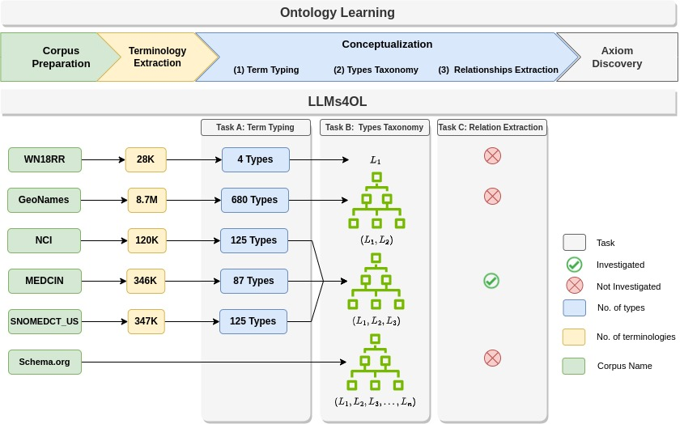
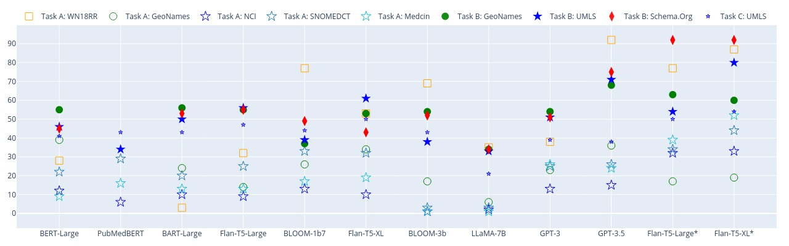

**| [LLMs4OL Paradigm](./README.md#llms4ol-paradigm) | [Task A: Term Typing](./TaskA/README.md) | [Task B: Type Taxonomy Discovery](./TaskB/README.md) | [Task C: Type Non-Taxonomic Relation Extraction](./TaskC/README.md) | [Finetuning](./tuning/README.md) | [Task A Detailed Results](./TaskA/results/readme.md) | [Task B Detailed Results](./TaskB/results/readme.md) | [Task C Detailed Results](./TaskC/results/readme.md) | [Task A Datasets](./datasets/TaskA/README.md) | [Task B Datasets](./datasets/TaskB/README.md) | [Task C Datasets](./datasets/TaskC/README.md) | [Finetuning Datasets](./datasets/Tuning/README.md) |**

----
<h1 align="center">LLMs4OL: Large Language Models for <br> Ontology Learning </h1>

[Hamed Babaei Giglou](https://hamedbabaei.github.io/), [Jennifer D'Souza](https://sites.google.com/view/jen-web), and [Sören Auer](https://www.tib.eu/en/research-development/research-groups-and-labs/data-science-digital-libraries/staff/soeren-auer) <br>
{hamed.babaei, jennifer.dsouza, auer}@tib.eu<br>
TIB Leibniz Information Center for Science and Technology, Hannover, Germany<br>
`Accepted for publication at ISWC 2023 - Research Track`

----

[//]: # (<br>)
<div align="center"></div>
<div align="center">Figure 1: The LLMs4OL task paradigm is an end-to-end conceptual framework for learning ontologies in different knowledge domain </div>
<br>

Ontology Learning (OL) addresses the challenge of knowledge acquisition and representation in a variety of domains. Recent advances in NLP and the emergence of Large Language Models, which have shown a capability to be good at crystallizing knowledge and patterns from vast text sources, we introduced the **LLMs4OL: Large Language Models for Ontology Learning** paradigm as an empirical study of LLMs for automated construction of ontologies from various domains.  The LLMs4OL paradigm tests *Does the capability of LLMs to capture intricate linguistic relationships translate effectively to OL, given that OL mainly relies on automatically extracting and structuring knowledge from natural language text?*.

### Table of Contents
- [Repository Structure](#repository-structure)
- [LLMs4OL Paradigm](#llms4ol-paradigm)
- [LLMs4OL Paradigm Setups](#llms4ol-paradigm-setups)
    - [Tasks](#tasks)
    - [Datasets](#datasets)
    - [Results](#results)
    - [Experimental LLMs](#experimental-llms)
- [Experiments](#experiments)
- [Results Overview](#results-overview)
- [How to run tasks](#how-to-run-tasks)
    - [Requirements](#requirements)
    - [Running Tasks](#running-tasks)
- [Citation](#citation)


## Repository Structure
```
.
└── LLMs4OL                             <- root directory of the repository
    ├── tuning                          <- Few-Shot finetuning directory
    │   └── ...
    ├── TaskA                           <- Term Typing task directory
    │   └── ...
    ├── TaskB                           <- Type Taxonomy Discovery task directory
    │   └── ...
    ├── TaskC                           <- Type Non-Taxonomic Relation Extraction task directory
    │   └── ...
    ├── assets                          <- artifacts directory 
    │   ├── LLMs                        <- contains pretrained LLMs
    │   ├── FSL                         <- contains fine-tuned LLMs (for training you should create this)
    │   ├── WordNetDefinitions          <- contains wordnet word definitions
    │   └── CountryCodes                <- GeoNames country codes
    ├── datasets                        <- contains datasets
    │   ├── FSL                         <- contains few-shot learning training datasets
    │   ├── TaskA                       <- contains directories for task A sources
    │   ├── TaskB                       <- contains directories for task B sources
    │   └── TaskC                       <- contains directories for task C sources
    ├── docs                            <- contains supplementary documents
    │   └── Supplementary-Material.pdf  <- contains directories for task C sources
    ├── images                          <- contains the figures
    ├── README.md                       <- README file for documenting the service.
    └── requirements.txt                <- contains Python requirements listed
```


## LLMs4OL Paradigm

The LLMs4OL paradigm offers a conceptual framework to accelerate the automated construction of ontologies exclusively by domain experts. OL tasks are based on the ontology primitives which consist of:

1. Corpus preparation – selecting and collecting the source texts to build the ontology. 
2. Terminology extraction – identifying and extracting relevant terms from the source text.
3. Term typing – grouping similar terms as conceptual types. 
4. Taxonomy construction – identifying the “is-a” hierarchies between types.
5. Relationship extraction – identifying and extracting “non-is-a” or semantic relationships between types
6. Axiom discovery – discovering constraints and inference rules for the ontology

Toward realizing LLMs4OL, we empirically ground three core tasks of OL leveraging LLMs as a foundational basis for future work. They are presented as:

- **Term Typing**
- **Type Taxonomy Discovery**  
- **Type Non-Taxonomic Relation Extraction**

## LLMs4OL Paradigm Setups

The LLMs4OL task paradigm is an end-to-end conceptual framework for learning ontologies in different knowledge domains with the aim of automation of ontology learning. 

### Tasks

The tasks within the blue arrow (in Figure-1) are the three OL tasks empirically validated. For each task, we created a directory with a detailed description of the task information as follows:

- [Task A. Term Typing](./TaskA/README.md) 
- [Task B. Type Taxonomy Discovery](./TaskB/README.md)
- [Task C. Type Non-Taxonomic Relation Extraction](./TaskC/README.md)

### Datasets
To comprehensively assess LLMs for the three OL tasks we cover a variety of ontological knowledge domain sources, i.e. lexicosemantics – [WN18RR](https://github.com/TimDettmers/ConvE) (WordNet), geography – [GeoNames](http://www.geonames.org/),
biomedicine – [NCI](https://www.nlm.nih.gov/research/umls/sourcereleasedocs/current/NCI/index.html), [MEDICIN](https://www.nlm.nih.gov/research/umls/sourcereleasedocs/current/MEDCIN/index.html), [SNOMEDCT\_US](https://www.nlm.nih.gov/research/umls/sourcereleasedocs/current/SNOMEDCT_US/index.html), and web content types – [Schema.Org](https://schema.org/). These sources are different for each task, so for each task, the detailed information is available as follows:

- [Task A. Term Typing Datasets](./datasets/TaskA/README.md): GeoNames, NCI, MEDICIN, SNOMEDCT\_US, and WN18RR
- [Task B. Type Taxonomy Discovery Datasets](./datasets/TaskB/README.md): GeoNames, Schema.Org, and [UMLS](https://lhncbc.nlm.nih.gov/semanticnetwork/)
- [Task C. Type Non-Taxonomic Relation Extraction Datasets](./datasets/TaskC/README.md): [UMLS](https://lhncbc.nlm.nih.gov/semanticnetwork/)


### Results

The evaluation metric for Task A is reported as the mean average precision at k (MAP@K), where k = 1, And evaluations for Tasks B and C are reported in terms of the standard F1-score based on precision and recall. Complete and detailed results for tasks are presented in the following tables:

- [Task A. Term Typing Detailed Results Table](./TaskA/results/readme.md) 
- [Task B. Type Taxonomy Discovery Detailed Results Table](./TaskB/results/readme.md) 
- [Task C. Type Non-Taxonomic Relation Extraction Detailed Results Table](./TaskC/results/readme.md)

### Experimental LLMs

We created experimentations using five different LMs. These LMs described as followings:

- Encoder-Only:
    - **[BERT-Large](https://huggingface.co/bert-large-uncased)** with 340M parameters
    - **[PubMedBERT](https://huggingface.co/microsoft/BiomedNLP-PubMedBERT-base-uncased-abstract-fulltext)** with 340M parameters
- Encoder-Decoder:
    - **[BART-Large](https://huggingface.co/facebook/bart-large)** with 400M parameters 
    - **[Flan-T5-Large](https://huggingface.co/google/flan-t5-large)** with 780M parameters
    - **[Flan-T5-XL](https://huggingface.co/google/flan-t5-xl)** with 3B parameters
- Decoder-Only:
    - **[BLOOM-1b7](https://huggingface.co/bigscience/bloom-1b7)** with 1.7B parameters
    - **[BLOOM-3b](https://huggingface.co/bigscience/bloomz-3b)** with 3B parameters
    - **[LLaMA-7b](https://ai.meta.com/blog/large-language-model-llama-meta-ai/)** with 7B parameters
    - **[GPT-3](https://platform.openai.com/docs/models/gpt-3)** with 175B parameters
    - **[GPT-3.5](https://platform.openai.com/docs/models/gpt-3-5)** with 174B parameters
    - **[GPT-4](https://platform.openai.com/docs/models/gpt-4)** with 1T parameters

## Experiments
First we created prompt templates based on existing experimental language models and their nature -- specifically for tasks A and B we created 8 templates per source, and for task C only a single template --. Next, we probe LMs as zero-shot testing. More later we attempt to boost the performance of two LLMs (Flan-T5-Large and Flan-T5-XL) in the form of few-shot learning using predefined prompt templates (different than zero-shot testing) and we test the model using zero-shot testing prompt templates. 

Prompt templates for zero-shot testing are represented as follows:

|Dataset| Task | prompt templates path | answer set mapper path|
|:---:|:----:|:---:|:---:|
|WN18RR |  A   | [`datasets/TaskA/WN18RR/templates.json`](datasets/TaskA/WN18RR/templates.json)| [`datasets/TaskA/WN18RR/label_mapper.json`](datasets/TaskA/WN18RR/label_mapper.json) |
|GeoNames |  A   | [`datasets/TaskA/Geonames/templates.json`](datasets/TaskA/Geonames/templates.json)| [`datasets/TaskA/Geonames/label_mapper.json`](datasets/TaskA/Geonames/label_mapper.json)|
|NCI, MEDICIN, SNOMEDCT\_US |  A   | [`datasets/TaskA/UMLS/templates.json`](datasets/TaskA/UMLS/templates.json)| [`datasets/TaskA/UMLS/label_mapper.json`](datasets/TaskA/UMLS/label_mapper.json)|
|Schema.Org, UMLS, GeoNames |   B  | [`datasets/TaskB/templates.txt`](datasets/TaskB/templates.txt)| [`datasets/TaskB/label_mapper.json`](datasets/TaskB/label_mapper.json)|
|UMLS |  C   | [`datasets/TaskC/templates.txt`](datasets/TaskC/templates.txt)| [`datasets/TaskC/label_mapper.json`](datasets/TaskC/label_mapper.json)|

Prompt templates for training model is represented as follows:

|Dataset| Task |           prompt templates path           | 
|:---:|:---:|:-----------------------------------------:|
|WN18RR, UMLS (NCI only), GeoNames, Schema.Org | A, B, C | [`tuning/templates.py`](FSL/templates.py) |

## Results Overview
<div align="center"></div>
<div align="center">Figure 2. Comparative visual of the zero-shot and finetuned results. Unfilled shapes, filled shapes, and small filled stars represent performances in tasks A, B, and C, respectively.</div>
<br>

## How to run tasks

### Requirements
**Software Requirements**:
- Python 3.9
- `requirements.txt` libraries

**Instructions**:

First, install the conda using conda [installation](https://conda.io/projects/conda/en/latest/user-guide/install/index.html) guideline, and then create and activate your environments as follows:

```cmd
conda create -n yourenvname python=3.9
conda activate yourenvname
```
Next, clone the repository and install the requirements from `requirements.txt` in your environments:
```cmd
git clone https://github.com/HamedBabaei/LLMs4OL.git

cd LLMs4OL

pip install -r requirements.txt
```
Next, add your OpenAI key to the `.env` file for experimentations on OpenAI models. Finally, start the experiments as described in the task directories.


### Running Tasks
To make each task behave separately as an encapsulated module, we have created separated directories for datasets as well as tasks and each task consists of a `test_auto.sh` shell script that automatically runs zero-shot testing on all the task datasets and produces results that will be stored in `TaskX/results/DATASET_NAME/` directory. Also, you can easily run any model on your desired input dataset by running `test_manual.sh` and it will ask for the dataset, output logs to store outputs, as well as model name and device (CPU or GPU). For each of the important direcotries  we produced the `test.py` scripts which will be called in `test_manual.sh` and `test_auto.sh` multiple times on different datasets. The strucutre of `TaskA`, `TaskB`, and `TaskC` directories are presented as follows (`LLMs4OL/TaskX` directory):

```
.
└── LLMs4OL                      
    ├── tuning   
    │   ├── ....
    │   ├── trainer.py
    │   └── train_eval.sh
    ├── TaskX             
    │   ├── ...
    │   ├── results
    │   |   ├── dataset1
    |   |   └── ....
    │   ├── ...
    │   ├── test.py
    │   ├── test_auto.sh
    │   ├── test_manual.sh
    │   └── README.md
    ...
```
The `train_eval.sh` in the `tuning` directory runs `trainer.py` for representative datasets and then walks through `TaskX` directories and calls `test.py` for evaluation of trained models for each dataset. How to run models in detail is described tasks directories readme.md files. 


## Citations

```
@InProceedings{llms4ol,
            author="Babaei Giglou, Hamed
            and D'Souza, Jennifer
            and Auer, Sören",
            title="LLMs4OL: Large Language Models for Ontology Learning",
            booktitle="International Semantic Web Conference",
            year="2023",
            publisher="Springer International Publishing",
}
```

Preprint:
```
@misc{giglou2023llms4ol,
      title={LLMs4OL: Large Language Models for Ontology Learning}, 
      author={Hamed Babaei Giglou and Jennifer D'Souza and Sören Auer},
      year={2023},
      eprint={2307.16648},
      archivePrefix={arXiv},
      primaryClass={cs.AI}
}
```