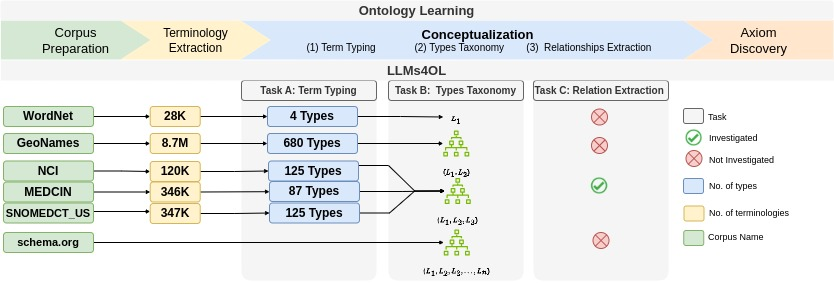

<h1 align="center">LLMs4OL: Large Language Models for   Ontology Learning 
</h1>

**| [LLMs4OL Paradigm](./README.md#llms4ol-paradigm) | [Task A: Term Typing](./TaskA/README.md) | [Task B: Type Taxonomy Discovery](./TaskB/README.md) | [Task C: Type Non-Taxonomic Relation Extraction](./TaskC/README.md) | [Few-Shot Learning](./FSL/README.md) | [Task A Detailed Results](./TaskA/results/readme.md) | [Task B Detailed Results](./TaskB/results/readme.md) | [Task C Detailed Results](./TaskC/results/readme.md) | [Task A Datasets](./datasets/TaskA/README.md) | [Task B Datasets](./datasets/TaskB/README.md) | [Task C Datasets](./datasets/TaskC/README.md) | [Few-Shot Learning Datasets](./datasets/FSL/README.md) |**

--------------

Ontology Learning (OL) addresses the challenge of knowledge acquisition and representation  in a variety of domains. Recent advances in NLP and the emergence of Large Language Models, which have shown a capability to be good at crystallizing knowledge and patterns from vast text sources, we introduced the **LLMs4OL: Large Language Models for Ontology Learning** paradigm as a empirical study of LLMs for automated construction of ontologies from various domains.  The LLMs4OL paradigm tests *Does the capability of LLMs to capture intricate linguistic relationships translate effectively to OL, given that OL mainly relies on automatically extracting and structuring knowledge from natural language text?*.

### Table of Contents
- [LLMs4OL Paradigm](#llms4ol-paradigm)
- [LLMs4OL Paradigm Setups](#llms4ol-paradigm-setups)
    - [Tasks](#tasks)
    - [Datasets](#datasets)
    - [Results](#results)
    - E[xperimental LLMs](#experimental-llms)
- How to run.
    - Software Dependencies and Requirements
- Citations

## LLMs4OL Paradigm

Figure 1: The LLMs4OL task paradigm is an end-to-end conceptual framework for learning ontologies in different knowledge domain

 
The LLMs4OL paradigm offers a conceptual framework to accelerate the automated construction of ontologies exclusively by domain experts. OL tasks are based on the ontology primitives which consist of:

1. Corpus preparation – selecting and collecting the source texts to build the ontology. 
2. Terminology extraction – identifying and extracting relevant terms from the source text.
3. Term typing – grouping similar terms as conceptual types. 
4. Taxonomy construction – identifying the “is-a” hierarchies between types.
5. Relationship extraction – identifying and extracting “non-is-a” or semantic relationships between types
6. Axiom discovery – discovering constraints and inference rules for the ontology

Toward realizing LLMs4OL, we empirically ground three core tasks of OL leveraging LLMs as a foundational basis for future work. They are presented as:

- **Term Typing**
- **Type Taxonomy Discovery** -- for type "is-a" taxonomy construction
- **Type Non-Taxonomic Relation Extraction** -- for type "non-is-a" taxonomy construction

## LLMs4OL Paradigm Setups

The LLMs4OL task paradigm is an end-to-end conceptual framework for learning ontologies in different knowledge domains with aim of automation of ontology learning. 

### Tasks

The tasks within the blue arrow (in Figure-1) are the three OL tasks empirically validated. For each task we created a directory with detailed description of the task informations as follows:

- [Task A. Term Typing](./TaskA/README.md) 
- [Task B. Type Taxonomy Discovery](./TaskB/README.md)
- [Task C. Type Non-Taxonomic Relation Extraction](./TaskC/README.md)

### Datasets
To comprehensively assess LLMs for the three OL tasks we cover a variety of ontological knowledge domain sources, i.e. lexicosemantics – WN18RR (WordNet), geography – GeoNames,
biomedicine – NCI, MEDICIN, SNOMEDCT, and web content types – Schema.Org. These sources are different for each task, so for each task the detailed information is avaliable as follows:

- [Task A. Term Typing Datasets](./datasets/TaskA/README.md): GeoNames, NCI, MEDICIN, SNOMEDCT, and WN18RR
- [Task B. Type Taxonomy Discovery Datasets](./datasets/TaskB/README.md): GeoNames, Schema.Org, and UMLS
- [Task C. Type Non-Taxonomic Relation Extraction Datasets](./datasets/TaskC/README.md): UMLS

### Results

Evaluations for Task A are reported as the mean average precision at k (MAP@K), where k = 1, since this metric was noted as being best suited to the task. Specifically, in our case, for term typing, MAP@1 measures the average precision of the top-1 ranked term types returned by an LLM for prompts initialized with terms from the evaluation set. And evaluations for Tasks B and
C are reported in terms of the standard F1-score based on precision and recall.

We evaluate different types of LLMs representative of different neural architecture building blocks that are respectively reported as state-of-the-art for different tasks in the community. A complete and detailed results for tasks are presented in the following tables:

- [Task A. Term Typing Detailed Results Table](./TaskA/results/readme.md) 
- [Task B. Type Taxonomy Discovery Detailed Results Table](./TaskB/results/readme.md) 
- [Task C. Type Non-Taxonomic Relation Extraction Detailed Results Table](./TaskC/results/readme.md)

### Experimental LLMs

We created experimentations using five different LMs. These LMs described as followings:
- **[BERT](https://huggingface.co/bert-large-uncased)**: A bidirectional transformer pre-trained by joint conditioning on both left and right context in all layers. It is a combination of Masked Language Modeling (MLM) and Next Sentence Prediction (NSP) objectives. BERT has been trained on a large corpus comprising the Toronto Book Corpus and Wikipedia.
- **[BART](https://huggingface.co/facebook/bart-large)**: Bart is trained by corrupting text with an arbitrary noising function, and learning a model to reconstruct the original text. It uses a standard seq2seq machine translation architecture with a bidirectional encoder and left-to-right decoder schemes where the encoder part is fed a corrupted version of the tokens, decoder part is fed the original tokens.
- **Flan-T5**: Flan-T5 is an encoder-decoder model pre-trained on a multi-task mixture of unsupervised and supervised tasks. It is trained based on instruction finetuning with a particular focus on (1) scaling the number of tasks, (2) scaling the model size, and (3) finetuning on chain-of-thought data. Flan-T5 uses T5 as a base model with instruction finetuning on several tasks that have shown a strong few-shot performance even compared to much larger models, such as PaLM 62B. In context of LLMs4OL we have used [Flan-T5-Large](https://huggingface.co/google/flan-t5-large) and [Flan-T5-XL](https://huggingface.co/google/flan-t5-xl) variants in our experimentations
- **BLOOM**: BLOOM is a decoder-only transformer language model that has 176B parameters and is trained on 366B tokens in 46 languages and 13 programming languages. BLOOM achieves competitive performance on a wide variety of benchmarks, with stronger results after undergoing multitask-prompted finetuning. In context of LLMs4OL we have used [BLOOM-1b7](https://huggingface.co/bigscience/bloom-1b7) and [BLOOM-3b](https://huggingface.co/bigscience/bloomz-3b) variants in our experimentations
- **[GPT-3](https://platform.openai.com/docs/models/gpt-3)**: GPT-3 is a decoder-only language model with 175 billion parameters that predicts the next word in the sequence. GPT-3 achieves strong performance on many NLP datasets, including translation, question-answering, and cloze tasks. 

## Repository Structure

## How to run

### Requirements
