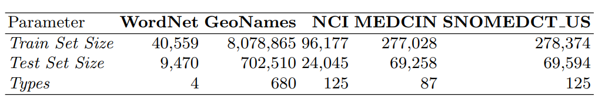

**| [LLMs4OL Paradigm](../../README.md#llms4ol-paradigm) | [Task A: Term Typing](../../TaskA/README.md) | [Task B: Type Taxonomy Discovery](../../TaskB/README.md) | [Task C: Type Non-Taxonomic Relation Extraction](../../TaskC/README.md) | [Finetuning](../../tuning/README.md) | [Task A Detailed Results](../../TaskA/results/readme.md) | [Task B Detailed Results](../../TaskB/results/readme.md) | [Task C Detailed Results](../../TaskC/results/readme.md) | [Task A Datasets](../../datasets/TaskA/README.md) | [Task B Datasets](../../datasets/TaskB/README.md) | [Task C Datasets](../../datasets/TaskC/README.md) | [Finetuning Datasets](../../datasets/Tuning/README.md) |**


## Task A. Term Typing Datasets
Task A term typing dataset counts across three core ontological knowledge sources, i.e. WordNet, GeoNames, and UMLS, where for Task A UMLS is represented only by the NCI, MEDCIN, and SNOMEDCT US subontological sources. The unique term types per source that defined Task A Ontology Learning is also provided.

1. GeoNames: https://www.geonames.org: size is 8M
2. NCI: (UMLS version 2022AB from Metathesaurus)
3. SNOMEDCT_US: (UMLS version 2022AB from Metathesaurus)
4. MEDCIN: (UMLS version 2022AB from Metathesaurus)
5. [WN18RR](https://github.com/TimDettmers/ConvE)

<div align="center"></div>
<div align="center">Figure: Statistics</div> 

## GeoNames Dataset Prompt Templates:
```json
{
    "bert":{
        "template-1": "[A] is a place in [COUNTRY]. [A] is a [MASK].",
        "template-2": "[A] is a place in [COUNTRY]. [A] geographically is a [MASK].", 
        "template-3": "[A] is a place in [COUNTRY]. '[A]' is a [MASK].",
        "template-4": "[A] is a place in [COUNTRY]. '[A]' geographically is a [MASK].", 
        "template-5": "[A] is a [MASK].",
        "template-6": "[A] geographically is a [MASK].",
        "template-7": "'[A]' is a [MASK].",
        "template-8": "'[A]' geographically is a [MASK]."
    },
    "t5":{
        "template-1": "[A] is a place in [COUNTRY]. [A] is a ?",
        "template-2": "[A] is a place in [COUNTRY]. [A] geographically is a ?",
        "template-3": "[A] is a place in [COUNTRY]. '[A]' is a ?",
        "template-4": "[A] is a place in [COUNTRY]. '[A]' geographically is a ?",
        "template-5": "[A] is a ?",
        "template-6": "[A] geographically is a ?",
        "template-7": "'[A]' is a ?",
        "template-8": "'[A]' geographically is a ?"
    },
    "bart":{
        "template-1": "[A] is a place in [COUNTRY]. [A] is a <mask> .",
        "template-2": "[A] is a place in [COUNTRY]. [A] geographically is a <mask> .",
        "template-3": "[A] is a place in [COUNTRY]. '[A]' is a <mask> .",
        "template-4": "[A] is a place in [COUNTRY]. '[A]' geographically is a <mask> .",
        "template-5": "[A] is a <mask> .",
        "template-6": "[A] geographically is a <mask> .",
        "template-7": "'[A]' is a <mask> .",
        "template-8": "'[A]' geographically is a <mask> ."
    },
    "gpt": {
        "template-1": "Perform a sentence completion on the following sentence:\nSentence: [A] is a place in [COUNTRY]. [A] is a ",
        "template-2": "Perform a sentence completion on the following sentence:\nSentence: [A] is a place in [COUNTRY]. [A] geographically is a ",
        "template-3": "Perform a sentence completion on the following sentence:\nSentence: [A] is a place in [COUNTRY]. '[A]' is a ",
        "template-4": "Perform a sentence completion on the following sentence:\nSentence: [A] is a place in [COUNTRY]. '[A]' geographically is a ",
        "template-5": "Perform a sentence completion on the following sentence:\nSentence: [A] is a ",
        "template-6": "Perform a sentence completion on the following sentence:\nSentence: [A] geographically is a ",
        "template-7": "Perform a sentence completion on the following sentence:\nSentence: '[A]' is a ",
        "template-8": "Perform a sentence completion on the following sentence:\nSentence: '[A]' geographically is a "
    },
    "bloom": {
        "template-1": "Perform a sentence completion on the following sentence:\nSentence: [A] is a place in [COUNTRY]. [A] is a",
        "template-2": "Perform a sentence completion on the following sentence:\nSentence: [A] is a place in [COUNTRY]. [A] geographically is a",
        "template-3": "Perform a sentence completion on the following sentence:\nSentence: [A] is a place in [COUNTRY]. '[A]' is a",
        "template-4": "Perform a sentence completion on the following sentence:\nSentence: [A] is a place in [COUNTRY]. '[A]' geographically is a",
        "template-5": "Perform a sentence completion on the following sentence:\nSentence: [A] is a",
        "template-6": "Perform a sentence completion on the following sentence:\nSentence: [A] geographically is a",
        "template-7": "Perform a sentence completion on the following sentence:\nSentence: '[A]' is a",
        "template-8": "Perform a sentence completion on the following sentence:\nSentence: '[A]' geographically is a"
    },
    "llama": {
        "template-1": "Perform a sentence completion on the following sentence: [A] is a place in [COUNTRY]. [A] is a ___.\nThe answer is",
        "template-2": "Perform a sentence completion on the following sentence: [A] is a place in [COUNTRY]. [A] geographically is a ___.\nThe answer is",
        "template-3": "Perform a sentence completion on the following sentence: [A] is a place in [COUNTRY]. '[A]' is a ___.\nThe answer is",
        "template-4": "Perform a sentence completion on the following sentence: [A] is a place in [COUNTRY]. '[A]' geographically is a ___.\nThe answer is",
        "template-5": "Perform a sentence completion on the following sentence: [A] is a ___.\nThe answer is",
        "template-6": "Perform a sentence completion on the following sentence: [A] geographically is a ___.\nThe answer is",
        "template-7": "Perform a sentence completion on the following sentence: '[A]' is a ___.\nThe answer is",
        "template-8": "Perform a sentence completion on the following sentence: '[A]' geographically is a ___.\nThe answer is"
    }
}
```

## NCI, SNOMEDCT_US, and MEDCIN Datasets Prompt Templates:
```json
{
    "bert":{
        "template-1": "[SENTENCE]. [A] in medicine is a [MASK].",
        "template-2": "[SENTENCE]. [A] in biomedicine is a [MASK].",
        "template-3": "[SENTENCE]. '[A]' in medicine is a [MASK].",
        "template-4": "[SENTENCE]. '[A]' in biomedicine is a [MASK].",
        "template-5": "[A] in medicine is a [MASK].",
        "template-6": "[A] in biomedicine is a [MASK].",
        "template-7": "'[A]' in medicine is a [MASK].",
        "template-8": "'[A]' in biomedicine is a [MASK]."
    },
    "t5":{
        "template-1": "[SENTENCE]. [A] in medicine is a ?",
        "template-2": "[SENTENCE]. [A] in biomedicine is a ?",
        "template-3": "[SENTENCE]. '[A]' in medicine is a ?",
        "template-4": "[SENTENCE]. '[A]' in biomedicine is a ?",
        "template-5": "[A] in medicine is a ?",
        "template-6": "[A] in biomedicine is a ?",
        "template-7": "'[A]' in medicine is a ?",
        "template-8": "'[A]' in biomedicine is a ?"
    },
    "bart":{
        "template-1": "[SENTENCE]. [A] in medicine is a <mask> .",
        "template-2": "[SENTENCE]. [A] in biomedicine is a <mask> .",
        "template-3": "[SENTENCE]. '[A]' in medicine is a <mask> .",
        "template-4": "[SENTENCE]. '[A]' in biomedicine is a <mask> .",
        "template-5": "[A] in medicine is a <mask> .",
        "template-6": "[A] in biomedicine is a <mask> .",
        "template-7": "'[A]' in medicine is a <mask> .",
        "template-8": "'[A]' in biomedicine is a <mask> ."
    },
    "gpt": {
        "template-1": "Perform a sentence completion on the following sentence:\nSentence: [SENTENCE]. [A] in medicine is a ",
        "template-2": "Perform a sentence completion on the following sentence:\nSentence: [SENTENCE]. [A] in biomedicine is a ",
        "template-3": "Perform a sentence completion on the following sentence:\nSentence: [SENTENCE]. '[A]' in medicine is a ",
        "template-4": "Perform a sentence completion on the following sentence:\nSentence: [SENTENCE]. '[A]' in biomedicine is a ",
        "template-5": "Perform a sentence completion on the following sentence:\nSentence: [A] in medicine is a ",
        "template-6": "Perform a sentence completion on the following sentence:\nSentence: [A] in biomedicine is a ",
        "template-7": "Perform a sentence completion on the following sentence:\nSentence: '[A]' in medicine is a ",
        "template-8": "Perform a sentence completion on the following sentence:\nSentence: '[A]' in biomedicine is a "

    },
    "bloom": {
        "template-1": "Perform a sentence completion on the following sentence:\nSentence: [SENTENCE]. [A] in medicine is a",
        "template-2": "Perform a sentence completion on the following sentence:\nSentence: [SENTENCE]. [A] in biomedicine is a",
        "template-3": "Perform a sentence completion on the following sentence:\nSentence: [SENTENCE]. '[A]' in medicine is a",
        "template-4": "Perform a sentence completion on the following sentence:\nSentence: [SENTENCE]. '[A]' in biomedicine is a",
        "template-5": "Perform a sentence completion on the following sentence:\nSentence: [A] in medicine is a",
        "template-6": "Perform a sentence completion on the following sentence:\nSentence: [A] in biomedicine is a",
        "template-7": "Perform a sentence completion on the following sentence:\nSentence: '[A]' in medicine is a",
        "template-8": "Perform a sentence completion on the following sentence:\nSentence: '[A]' in biomedicine is a"

    },
    "llama": {
        "template-1": "Perform a sentence completion on the following sentence: [SENTENCE]. [A] in medicine is a ___.\nThe answer is",
        "template-2": "Perform a sentence completion on the following sentence: [SENTENCE]. [A] in biomedicine is a ___.\nThe answer is",
        "template-3": "Perform a sentence completion on the following sentence: [SENTENCE]. '[A]' in medicine is a ___.\nThe answer is",
        "template-4": "Perform a sentence completion on the following sentence: [SENTENCE]. '[A]' in biomedicine is a ___.\nThe answer is",
        "template-5": "Perform a sentence completion on the following sentence: [A] in medicine is a ___.\nThe answer is",
        "template-6": "Perform a sentence completion on the following sentence: [A] in biomedicine is a ___.\nThe answer is",
        "template-7": "Perform a sentence completion on the following sentence: '[A]' in medicine is a ___.\nThe answer is",
        "template-8": "Perform a sentence completion on the following sentence: '[A]' in biomedicine is a ___.\nThe answer is"
    }
}
```

## WN18RR Dataset Prompt Templates:
```json
{
    "bert":{
        "template-1": "[SENTENCE]. [A] POS is a [MASK].",
        "template-2": "[SENTENCE]. [A] part of speech is a [MASK].",
        "template-3": "[SENTENCE]. '[A]' POS is a [MASK].",
        "template-4": "[SENTENCE]. '[A]' part of speech is a [MASK].",
        "template-5": "[A] POS is a [MASK].",
        "template-6": "[A] part of speech is a [MASK].",
        "template-7": "'[A]' POS is a [MASK].",
        "template-8": "'[A]' part of speech is a [MASK]."
    },
    "t5":{
        "template-1": "[SENTENCE]. [A] POS is a ?",
        "template-2": "[SENTENCE]. [A] part of speech is a ?",
        "template-3": "[SENTENCE]. '[A]' POS is a ",
        "template-4": "[SENTENCE]. '[A]' part of speech is a ?",
        "template-5": "[A] POS is a ",
        "template-6": "[A] part of speech is a ?",
        "template-7": "'[A]' POS is a ",
        "template-8": "'[A]' part of speech is a ?"
    },
    "bart":{
        "template-1": "[SENTENCE]. [A] POS is a <mask> .",
        "template-2": "[SENTENCE]. [A] part of speech is a <mask> .",
        "template-3": "[SENTENCE]. '[A]' POS is a <mask> .",
        "template-4": "[SENTENCE]. '[A]' part of speech is a <mask> .",
        "template-5": "[A] POS is a <mask> .",
        "template-6": "[A] part of speech is a <mask> .",
        "template-7": "'[A]' POS is a <mask> .",
        "template-8": "'[A]' part of speech is a <mask> ."
    },
    "gpt": {
        "template-1": "Perform a sentence completion on the following sentence:\nSentence: [SENTENCE]. [A] POS is a ",
        "template-2": "Perform a sentence completion on the following sentence:\nSentence: [SENTENCE]. [A] part of speech is a ",
        "template-3": "Perform a sentence completion on the following sentence:\nSentence: [SENTENCE]. '[A]' POS is a ",
        "template-4": "Perform a sentence completion on the following sentence:\nSentence: [SENTENCE]. '[A]' part of speech is a ",
        "template-5": "Perform a sentence completion on the following sentence:\nSentence: [A] POS is a ",
        "template-6": "Perform a sentence completion on the following sentence:\nSentence: [A] part of speech is a ",
        "template-7": "Perform a sentence completion on the following sentence:\nSentence: '[A]' POS is a ",
        "template-8": "Perform a sentence completion on the following sentence:\nSentence: '[A]' part of speech is a "
    },
    "bloom": {
        "template-1": "Perform a sentence completion on the following sentence:\nSentence: [SENTENCE]. [A] POS is a",
        "template-2": "Perform a sentence completion on the following sentence:\nSentence: [SENTENCE]. [A] part of speech is a",
        "template-3": "Perform a sentence completion on the following sentence:\nSentence: [SENTENCE]. '[A]' POS is a",
        "template-4": "Perform a sentence completion on the following sentence:\nSentence: [SENTENCE]. '[A]' part of speech is a",
        "template-5": "Perform a sentence completion on the following sentence:\nSentence: [A] POS is a",
        "template-6": "Perform a sentence completion on the following sentence:\nSentence: [A] part of speech is a",
        "template-7": "Perform a sentence completion on the following sentence:\nSentence: '[A]' POS is a",
        "template-8": "Perform a sentence completion on the following sentence:\nSentence: '[A]' part of speech is a"
    },
    "llama": {
        "template-1": "Perform a sentence completion on the following sentence: [SENTENCE]. [A] POS is a ___.\nThe answer is",
        "template-2": "Perform a sentence completion on the following sentence: [SENTENCE]. [A] part of speech is a ___.\nThe answer is",
        "template-3": "Perform a sentence completion on the following sentence: [SENTENCE]. '[A]' POS is a ___.\nThe answer is",
        "template-4": "Perform a sentence completion on the following sentence: [SENTENCE]. '[A]' part of speech is a ___.\nThe answer is",
        "template-5": "Perform a sentence completion on the following sentence: [A] POS is a ___.\nThe answer is",
        "template-6": "Perform a sentence completion on the following sentence: [A] part of speech is a ___.\nThe answer is",
        "template-7": "Perform a sentence completion on the following sentence: '[A]' POS is a ___.\nThe answer is",
        "template-8": "Perform a sentence completion on the following sentence: '[A]' part of speech is a ___.\nThe answer is"
    }
}
```