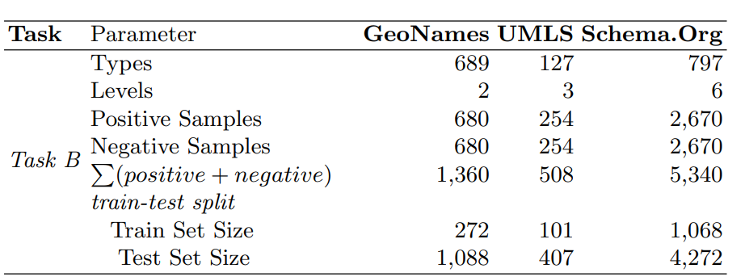

**| [LLMs4OL Paradigm](../../README.md#llms4ol-paradigm) | [Task A: Term Typing](../../TaskA/README.md) | [Task B: Type Taxonomy Discovery](../../TaskB/README.md) | [Task C: Type Non-Taxonomic Relation Extraction](../../TaskC/README.md) | [Finetuning](../../tuning/README.md) | [Task A Detailed Results](../../TaskA/results/readme.md) | [Task B Detailed Results](../../TaskB/results/readme.md) | [Task C Detailed Results](../../TaskC/results/readme.md) | [Task A Datasets](../../datasets/TaskA/README.md) | [Task B Datasets](../../datasets/TaskB/README.md) | [Task C Datasets](../../datasets/TaskC/README.md) | [Finetuning Datasets](../../datasets/Tuning/README.md) |**


## Task B. Type Taxonomy Discovery Datasets
From GeoNames, UMLS, and schema.org we obtained 680, 127, and 797 term types constituting type taxonomies. Dataset statistics as counts per reported parameter for Task B type taxonomic hierarchy discovery.

<div align="center"></div>
<div align="center">Figure: Statistics</div> 

## Prompt Templates
```text
{"placeholder": "text_a"} is the superclass of {"placeholder": "text_b"}. This statement is a {"mask"} .
{"placeholder": "text_b"} is a subclass of {"placeholder": "text_a"}. This statement is a {"mask"} .
{"placeholder": "text_a"} is the parent class of {"placeholder": "text_b"}. This statement is a {"mask"} .
{"placeholder": "text_b"} is a child class of {"placeholder": "text_a"}. This statement is a {"mask"} .
{"placeholder": "text_a"} is a supertype of {"placeholder": "text_b"}. This statement is a {"mask"} .
{"placeholder": "text_b"} is a subtype of {"placeholder": "text_a"}. This statement is a {"mask"} .
{"placeholder": "text_a"} is an ancestor class of {"placeholder": "text_b"}. This statement is a {"mask"} .
{"placeholder": "text_b"} is a descendant class of {"placeholder": "text_a"}. This statement is a {"mask"} .
```

<!-- 
## Geonames:
- Source of information for feature codes: https://www.geonames.org/export/
- size of processed hierarchy in GeoNames is (positive and negatives) : 1360
- positive size is: 680
- total number of types: 680
- Train size:272,  Test size:1088
## UMLS:
- Link to semantic network of the UMLS: https://lhncbc.nlm.nih.gov/semanticnetwork/ 
- size of processed hierarchy in UMLS is : 508
- positive size is: 254
- total number of types: 127
- Train size:101,  Test size:407
- 
## Schema.ORG
- Source Information for Schema.Org is: https://schema.org/docs/full.html
- size of processed hierarchy in UMLS is : 5340
- positive size is: 2670
- total number of types: 1344
- Train size:1068,  Test size:4272 -->
