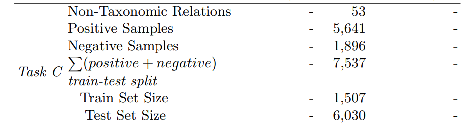

**| [LLMs4OL Paradigm](../../README.md#llms4ol-paradigm) | [Task A: Term Typing](../../TaskA/README.md) | [Task B: Type Taxonomy Discovery](../../TaskB/README.md) | [Task C: Type Non-Taxonomic Relation Extraction](../../TaskC/README.md) | [Finetuning](../../tuning/README.md) | [Task A Detailed Results](../../TaskA/results/readme.md) | [Task B Detailed Results](../../TaskB/results/readme.md) | [Task C Detailed Results](../../TaskC/results/readme.md) | [Task A Datasets](../../datasets/TaskA/README.md) | [Task B Datasets](../../datasets/TaskB/README.md) | [Task C Datasets](../../datasets/TaskC/README.md) | [Finetuning Datasets](../../datasets/Tuning/README.md) |**

## Task C. Type Non-Taxonomic Relation Extraction Datasets

We found UMLS as only available ontological knowledge source among those we considered i.e. UMLS with 53 non-taxonomic relations across its 127 term types.

Figure: Statistics

<!-- 
# UMLS

- Whole SN size: 6217
- Types no : 127
- Relations no: 53
- TRIPLES size (positives)--ignoring Is-A: 5641
- 1-M triples : 683
- Negative examples: 1896
- Positive Samples: 5641
- size of processed hierarchy in UMLS is : 7537
- Train size:1507,  Test size:6030 -->